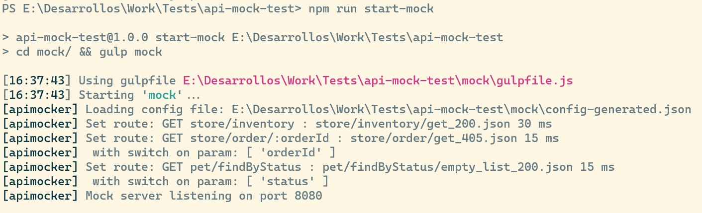
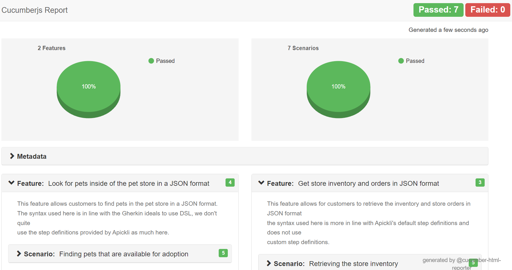

# api-mock-test

This is a project used as an example of [Cucumber](https://cucumber.io/) tests and the [Gherkin syntax](https://cucumber.io/docs/gherkin/) in Node.js using [Apickli](https://github.com/apickli/apickli).

The project connects to the [Swagger Petstore](https://petstore.swagger.io/) to perform tests over a [subset](https://github.com/hdmsantander/api-mock-test/blob/main/mock/oas/pet-shop.json) of the endpoints of the API, it also can connect instead to a mocked version of the same API provided on localhost using [apimocker](https://github.com/gstroup/apimocker).

# Operations

The following operations are available in the project:

## Installing dependencies

To install the required dependencies for the project run `npm run init-project`.

## Running mock server

To start the mock API locally run `npm run start-mock`

## Running Cucumber tests

To perform the Cucumber tests and generate a file called _./cucumber_report.html_ run: `npm run start-tests`

The project can switch between using the real API or the mocked local API of the Pet Store. If the environment variable _USE_MOCK_FOR_TESTS_ is set to **true** the tests will point to _http://localhost:8080_, if the variable is set to **false** or it's not set the tests will point to _https://petstore.swagger.io/_

If the variable _USE_MOCK_FOR_TESTS_ is set to **true** the mock server [must be running](https://github.com/hdmsantander/api-mock-test#running-mock-server) on the background.

## Code formatting

To run the formatter over the source code run `npm run format`

# Project structure

The project is divided into two parts:

## Mock server

This [part of the project](https://github.com/hdmsantander/api-mock-test/tree/main/mock) is the one in charge of running the mocked API of the pet shop.



It consists of three parts:

- [Mocks directory](https://github.com/hdmsantander/api-mock-test/tree/main/mock/mocks): This directory holds the responses returned by the program, the rules which are evaluated to determine the responses to the requests receieved can be seen [here](https://github.com/hdmsantander/api-mock-test/blob/main/mock/config-generated.json).
- [Open API specification](https://github.com/hdmsantander/api-mock-test/blob/main/mock/oas/pet-shop.yaml): This file is an Open API specification of a subset of the endpoints of the pet shop API. These endpoints are the ones mocked by this program.
- [Gulpfile](https://github.com/hdmsantander/api-mock-test/blob/main/mock/gulpfile.js): This file allows for the execution of the mock server.

## Test suite

This [part of the project](https://github.com/hdmsantander/api-mock-test/tree/main/test) is the one in charge of running the Cucumber tests over the API (the one provided by swagger and the one that is mocked locally) and generating an HTML report containing the results of the tests:



It follows the reccomended structure of a Cucumber project:

```
test/
---- features/
--------- step_definitions/
-------------- apickli-gherkin.js
-------------- custom-steps.js
--------- support/
-------------- init.js
--------- find_pets_by_status_pure_gherkin.feature
--------- get_inventory.feature
---- package.json

```

For more information on how the structure works see: [Cucumber overview](https://cucumber.io/docs/guides/overview/)
